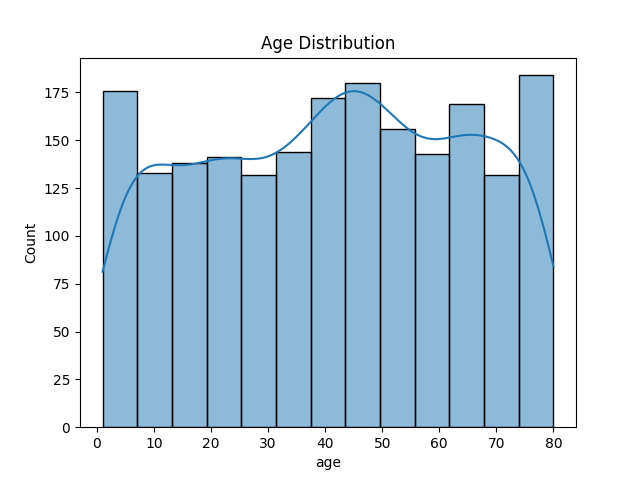
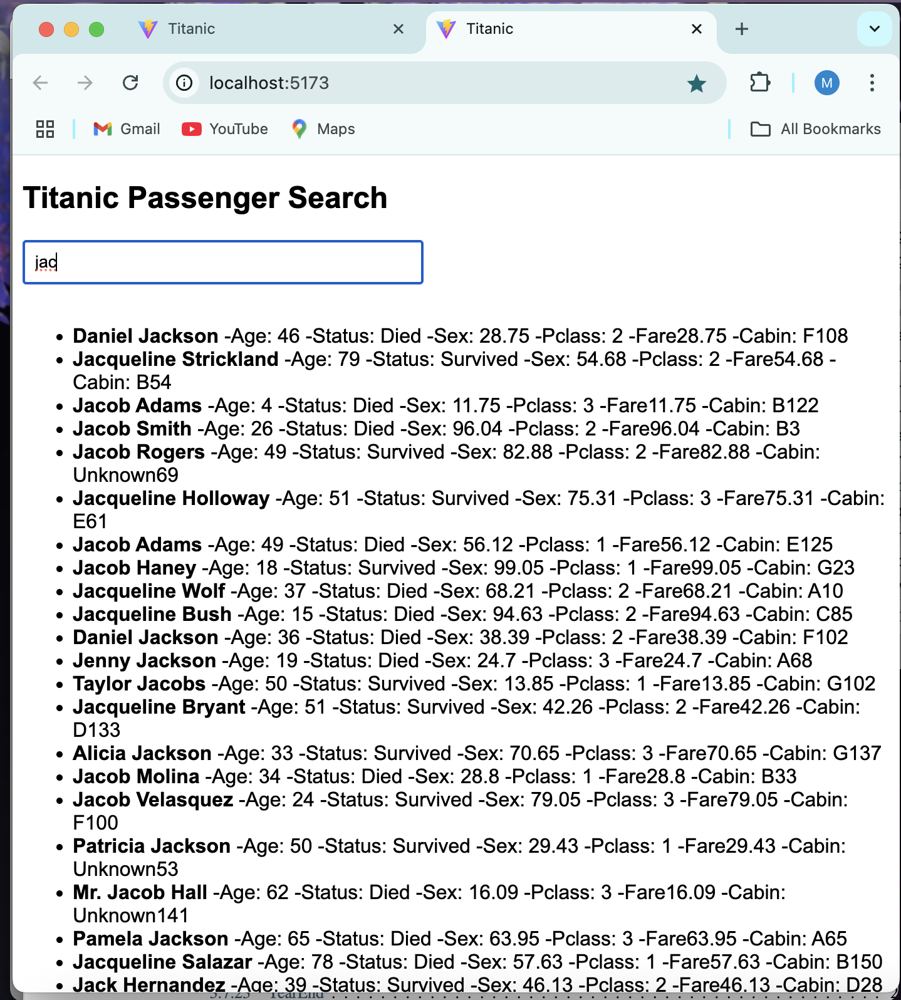

# Titanic-Details

A full-stack web application for exploring Titanic passenger data, built with a Node.js/Express backend, React frontend, and Python data analysis. This project allows users to search for Titanic passengers and visualize survival statistics.

---

## Table of Contents

- [Titanic-Details](#titanic-details)
  - [Table of Contents](#table-of-contents)
  - [Project Structure](#project-structure)
  - [Features](#features)
  - [Setup Instructions](#setup-instructions)
    - [1. Backend](#1-backend)
      - [Prerequisites](#prerequisites)
      - [Installation](#installation)
      - [Running the Server](#running-the-server)
    - [2. Frontend](#2-frontend)
      - [Prerequisites](#prerequisites-1)
      - [Installation](#installation-1)
      - [Running the Frontend](#running-the-frontend)
    - [3. Python Analysis](#3-python-analysis)
      - [Prerequisites](#prerequisites-2)
      - [Installation](#installation-2)
      - [Running the Notebook](#running-the-notebook)
  - [API Endpoints](#api-endpoints)
  - [Data Visualizations](#data-visualizations)
    - [1. Survival Count](#1-survival-count)
    - [2. Age Distribution](#2-age-distribution)
    - [3. General Data Plot](#3-general-data-plot)
  - [User Interface](#user-interface)
  - [License](#license)

---

## Project Structure

```
Titanic-Details/
├── Backend/
│   ├── data/
│   │   └── titanic.json
│   ├── routes/
│   │   └── passengers.js
│   ├── utils/
│   │   └── convert_to_json.py
│   ├── package.json
│   └── server.js
├── Frontend/
│   ├── public/
│   ├── src/
│   │   ├── App.jsx
│   │   ├── main.jsx
│   │   └── ...
│   ├── package.json
│   └── ...
├── python/
│   ├── process.ipynb
│   └── output/
│       ├── age_distribution.png
│       ├── plot.png
│       └── survival.png
└── README.md
```

---

## Features

- **Search Titanic Passengers:** Search by name and view detailed information.
- **Data Visualizations:** Python-generated graphs for survival count and age distribution.
- **REST API:** Query passenger data via HTTP endpoints.
- **Modern UI:** Responsive React frontend with live search.

---

## Setup Instructions

### 1. Backend

#### Prerequisites

- Node.js (v18+ recommended)
- npm

#### Installation

```bash
cd Backend
npm install
```

#### Running the Server

```bash
npm start
```

The backend will run on [http://localhost:5050](http://localhost:5050).

---

### 2. Frontend

#### Prerequisites

- Node.js
- npm

#### Installation

```bash
cd Frontend
npm install
```

#### Running the Frontend

```bash
npm run dev
```

The frontend will run on [http://localhost:5173](http://localhost:5173).

---

### 3. Python Analysis

#### Prerequisites

- Python 3.x
- pip
- Jupyter Notebook

#### Installation

```bash
cd python
pip install pandas matplotlib seaborn
```

#### Running the Notebook

Open `process.ipynb` in Jupyter and run all cells. This will generate the following graphs in the `output/` directory:

- `age_distribution.png`
- `plot.png`
- `survival.png`

---

## API Endpoints

- `GET /api/passengers/search?name=<query>`  
  Returns a list of passengers matching the name query.

Example:
```http
GET http://localhost:5050/api/passengers/search?name=jack
```

---

## Data Visualizations

### 1. Survival Count


*This bar chart shows the number of passengers who survived versus those who died. It provides a quick overview of the overall survival rate on the Titanic.*

---

### 2. Age Distribution



*This histogram displays the distribution of passenger ages. The KDE curve overlays the histogram to show the density of ages among all passengers.*

---

### 3. General Data Plot


*This plot provides a general visualization of the dataset, which can be customized further for deeper insights.*

---
## User Interface

Below is a screenshot of the Titanic Passenger Search UI:



**Description:**

- The search bar allows users to type a passenger's name (e.g., "jad").
- The results list displays matching passengers with their details:
  - **Name** (bold)
  - Age
  - Status (Survived/Died)
  - Sex
  - Pclass (Passenger class)
  - Fare
  - Cabin

This interface provides a fast, interactive way to explore Titanic passenger data.

**Description:**

- The search bar allows users to type a passenger's name (e.g., "jad").
- The results list displays matching passengers with their details:
  - **Name** (bold)
  - Age
  - Status (Survived/Died)
  - Sex
  - Pclass (Passenger class)
  - Fare
  - Cabin
 
 ---

This interface provides a fast, interactive way to explore Titanic passenger data.

---
This interface provides a fast, interactive way to explore Titanic passenger data.

---

## License

This project is for educational purposes.

---

*For any questions or contributions, please open an issue or pull request.*